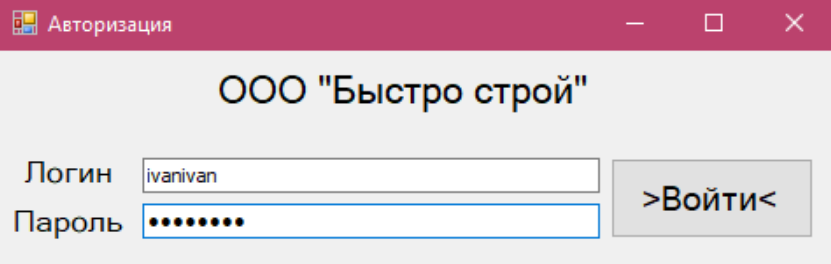
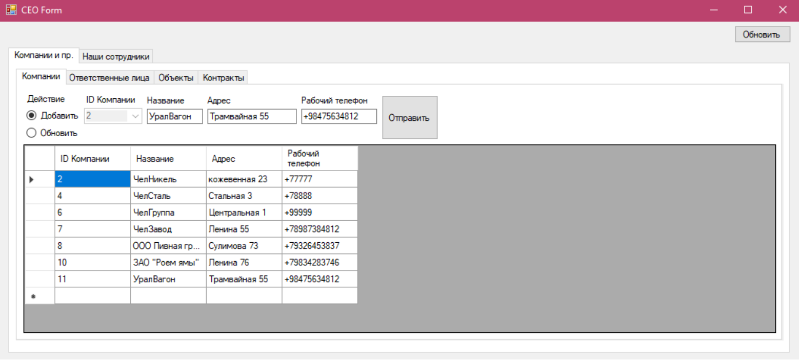
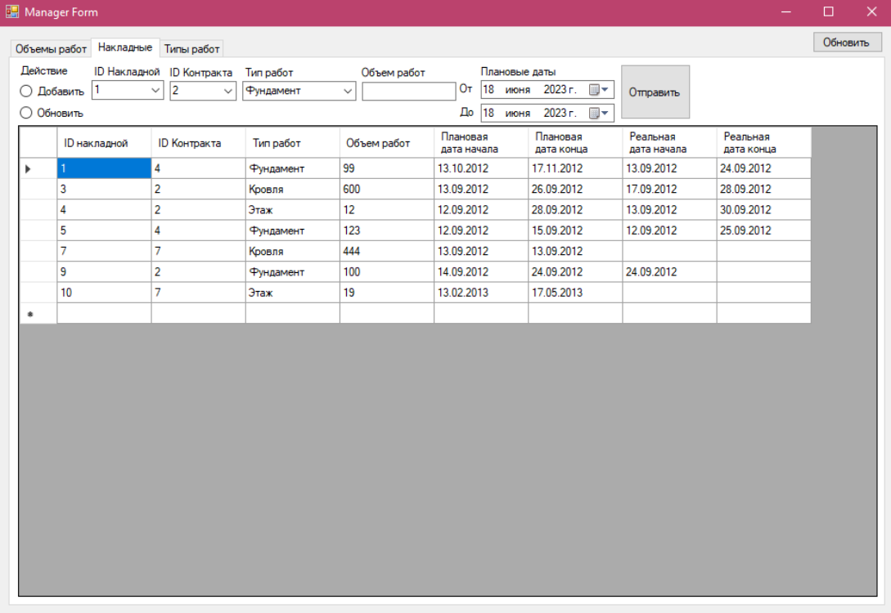
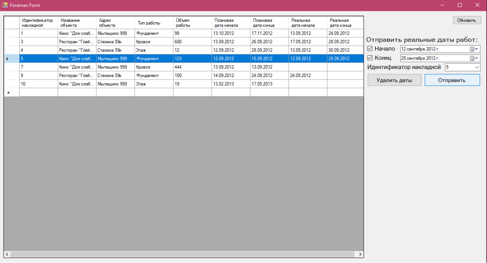
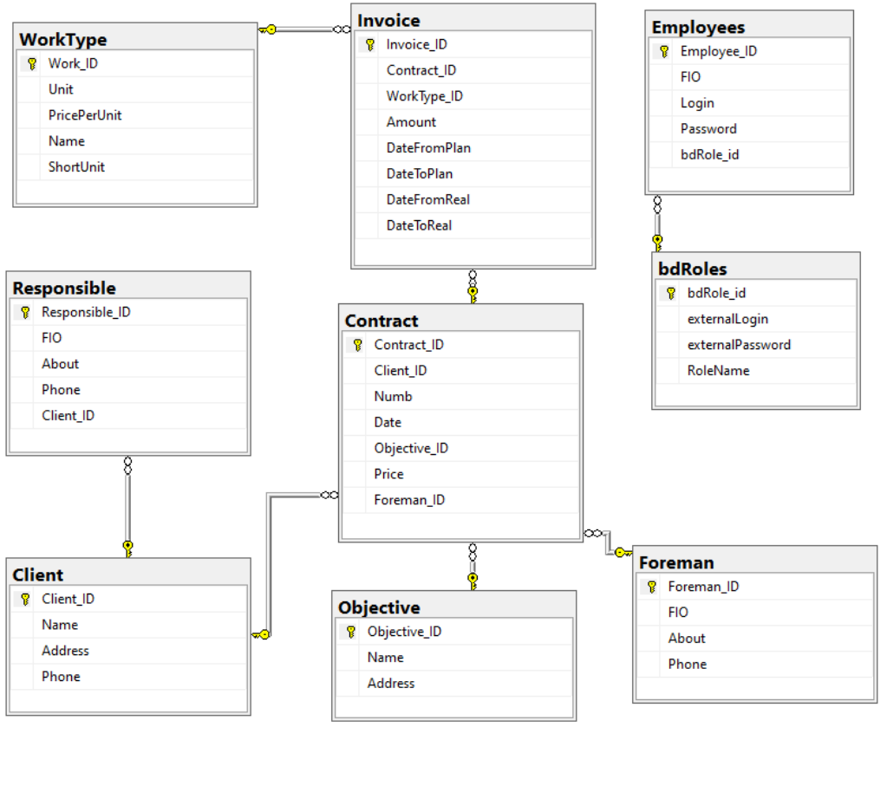

# GUI для работы строительного подрядчика

## Графический интерфейс
#### Окно авторизации
Для начала работы с приложением необходимо установить соединение с SQL-сервером, на котором размещена заранее разработанная база данных.

#### Рабочая область директора
Директор видит следующие таблицы: компании(клиенты), их ответственные лица, объекты работ, контракты, а также сотрудников и прорабов. Он также может добавлять и обновлять данные во всех соответствующих таблицах.

#### Рабочая область менеджера (планового отдела)
Сотрудник планового отдела видит и может добавлять и обновлять таблицы накладных и типов работ, а также может посмотреть объемы выполненных/невыполненных работ на разных объектах по типам работ.

#### Рабочая область прораба
Прораб может просматривать список накладных и изменять реальные даты работ.

## Инфологическая модель
Организация (Организация-Подрядчик) выполняет строительные работы по договорам с другими организациями. 

Организация-заказчик заказывает организации-подрядчику выполнение строительных работ. Владельцем базы данных является организация-подрядчик. Для каждого заказчика известны: название организации, адрес, контактные лица с указанием их должности, ФИО и телефона. С заказчиком заключается договор, в котором указывается № договора (проставляется исполнителем), дата договора, сумма договора, которая вычисляется как сумма стоимости всех выполняемых видов работ, плановая и фактическая дата завершения договора. Плановая дата – это дата завершения последней из работ в плане работ, аналогично фактическая.

Объём каждого из видов работ исчисляется в соответствующих единицах измерения (метры, килограммы, кубометры…). Для единицы измерения предусматривается полное и сокращённое наименование (метр – м, килограмм – кг…). Для каждого вида работ в плане, являющемся составной частью договора, указывается стоимость выполнения одной единицы вида работ, объём работ для данного вида работ, плановые и фактические даты начала и конца выполнения вида работ. Каждый договор относится к определённому объекту (наименование, адрес). 

За выполнение работ на объекте отвечает прораб.
### Пользователи системы
- Директор (Д)
- Плановый отдел (ПЛ)
- Прораб (ПР)

### Автоматизируемые функции
- Получение, создание и изменение информации об ответственных со стороны клиента, клиентах, контрактах, объектах, прорабах (Д) 
- Получение информации о прорабе(Д)
- Получение информации о контрактах, объектах, накладных и типах работ (ПР, ПЛ)
- Обновление накладных (ПР)
- Обновление, создание накладных и типов работ (ПЛ)
- Получение отчетов по выполненным работам за конкретный период(ПЛ, Д)
- Стоимость контракта(с учетов всех накладных по нему) (ПЛ, Д)

### Основной бизнес-процесс системы
Операции, связанные с получением заказов, заключением договоров, учетом заказчиков и объектов, определением стоимости и объема работ, планированием и контролем выполнения работ, а также управлением ответственностью за их выполнение.

## Схема базы данных MSQL
В базе данных существуют следующие сущности:
- WorkType - Тип работы
- Responsible - Ответственный со стороны компании-заказчика
- Client - Клиент
- Objective - Объект работ
- Contract - Контракт
- Invoice - Накладная
- Foreman - Прораб
- Employees - Сотрудники компании-подрядчика
- bdRoles - Роли базы данных

